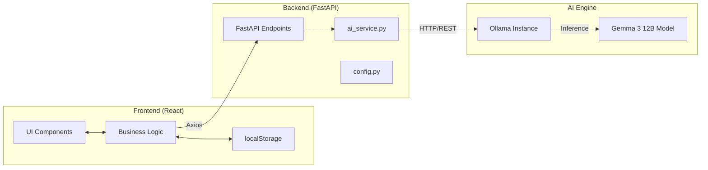

# Architecture Overview - GreenNova

## 1. System Overview
GreenNova follows a decoupled client-server architecture. The **Frontend (React)** communicates with the **Backend (FastAPI)** through a RESTful API. The Backend leverages **Ollama (Gemma 3 12B)** for advanced environmental analysis.

## 2. High-Level Architecture Diagram

## 3. Technology Stack Breakdown

### 3.1 Frontend
- **Framework**: React 18
- **Build Tool**: Vite
- **Styling**: Tailwind CSS
- **Visualization**: Recharts (Carbon footprint trends)
- **HTTP Client**: Axios

### 3.2 Backend
- **Framework**: FastAPI
- **Language**: Python 3.10+
- **AI Library**: `ollama` Python client
- **Server**: Uvicorn

### 3.3 AI Model
- **Model**: Gemma 3 12B (via Ollama)
- **Functions**: Image identification (product labels), ingredient analysis, eco-scoring.

## 4. Key Design Patterns

### 4.1 Mock Mode Strategy
Both frontend and backend are designed with a **Mock Mode** toggle.
- **Frontend (VITE_MOCK_MODE)**: Skips real API calls for UI testing if enabled.
- **Backend (MOCK_MODE in ai_service.py)**: Returns predefined JSON reports without invoking Ollama.

### 4.2 Data Persistence
Purchase history is stored as JSON in the browser's `localStorage`. This ensures high performance and immediate availability for the carbon footprint tracker.

### 4.3 Component Reusability
The `<SustainabilityScoreCard />` is a cross-platform (Home/Report/History) component ensuring a consistent design language for GreenNova.
