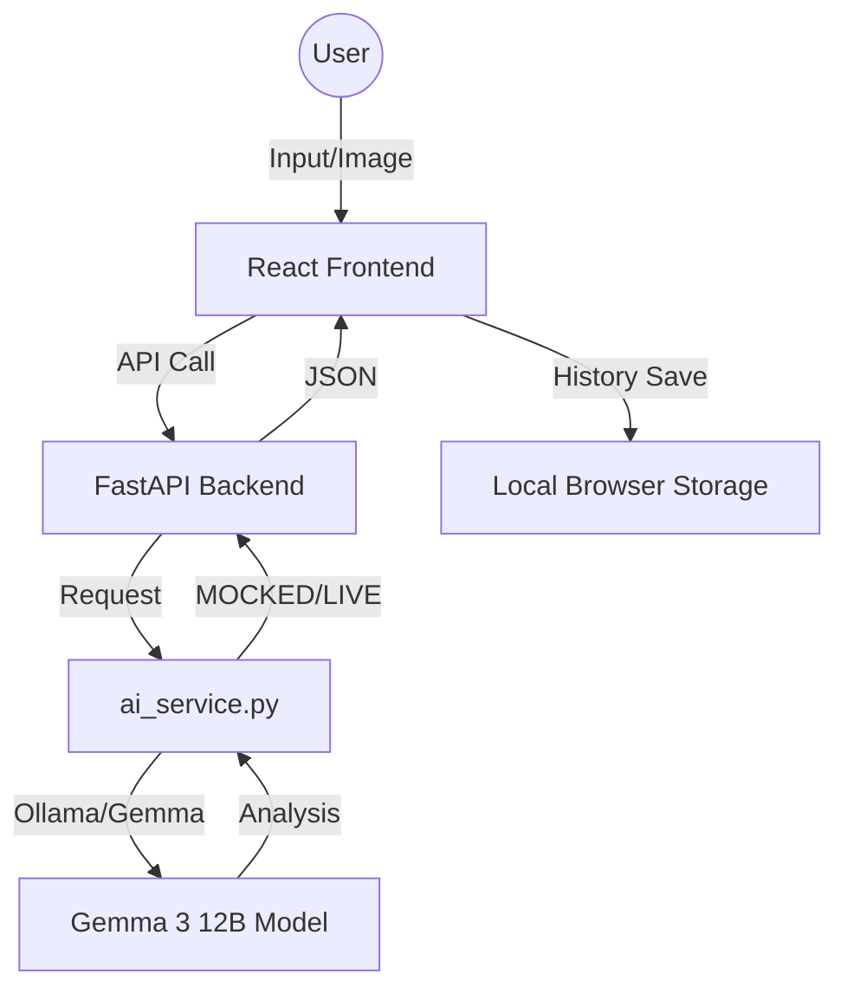

# Project Design - GreenNova

## 1. Frontend Architecture (React)

### 1.1 Core Components
- **`SustainabilityScoreCard`**: High-level summary of product sustainability, with color-coded scores and badges.
- **`ReportDetail`**: Full display of ingredients breakdown and alternatives.
- **`HistoryDashboard`**: Visualization of weekly/monthly trend charts using **Recharts**.
- **`SearchBox`**: Input field for text strings, barcode scans, or image uploads.
- **`NotificationBanner`**: Warning banners for high-carbon footprint patterns.

### 1.2 State Management
- **Local Storage**: Exclusively used for storing purchase history, badges, and user preferences. No user accounts or authentication.
- **Data Privacy**: All personal tracking data is stored only in the browser's `localStorage`.

### 1.3 UI/UX Design (Tailwind CSS)
- **Palette**: Nature-inspired greens (Emerald-500, Lime-400) and earthy tones (Slate-800, Amber-400).
- **Typography**: Modern, readable fonts (e.g., Inter, Roboto).
- **Icons**: Lucide-react or similar for eco-related icons (leaves, globes, recycling).

## 2. Backend Architecture (FastAPI)

### 2.1 AI Service Integration
- **Ollama Integration**: Utilizing Gemma 3 12B for text and image analysis.
- **Mock Service Mode**: Toggleable mode for faster development.
- **Data Flow**:
  - `POST /api/analyze` → `ai_service.py` (AI Analysis) → JSON Report.
  - `POST /api/search` → `ai_service.py` (Category match) → Sustainability Report.

### 2.2 Data Architecture (Python)
- **Schema Management**: Pydantic models for product reports and search results.
- **Stateless API**: The backend is completely stateless and handles no user data or session management.

## 3. System Data Flow

## 4. Key UI Components
- **SustainabilityScoreCard**:
  - `score: number` (0-100)
  - `tier: 'GREEN' | 'AMBER' | 'RED'`
  - `message: string`
  - `badge: string` (e.g., "Eco Champion 🌱")
